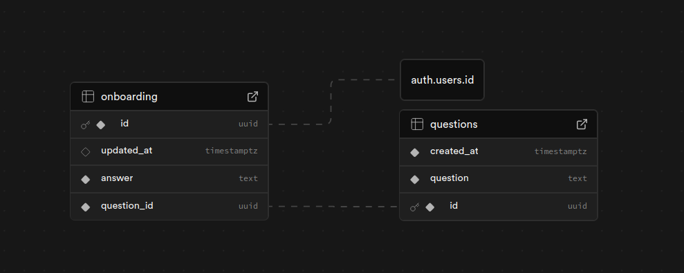

# Supabase Setup and Documentation

## Authentication

- Email/Password, magic links...
- OAuth Providers (Google)

### Email:

- Frontend implementation references:
  - use [react's](https://supabase.com/docs/guides/auth#authentication) for csr and
  - use [nextjs's](https://supabase.com/docs/guides/auth/quickstarts/nextjs) for ssr

### OAuth (Google):

- Frontend implementation references:
  - https://supabase.com/docs/guides/auth/social-login/auth-google - for Google OAuth setup and One-tap sign-in

## Database



### DB Docs - Frontend Usage:

- Onboarding
  - REST API
  - SUPABASE_CLIENT

#### REST API: **Base URL**

```curl
https://knkrtfwifjqsszvkosdp.supabase.co/rest/v1
```

You **must** request with these headers

```curl
Authorization: Bearer <anon-key>
Content-Type: application/json
```

##### **GET**

```
GET https://knkrtfwifjqsszvkosdp.supabase.co/rest/v1/onboarding
  ?id=eq.<USER_ID>
  &select=questions(id,question,created_at),answer,question_id
```

##### **POST**

```
POST https://knkrtfwifjqsszvkosdp.supabase.co/rest/v1/onboarding
```

Body:

```json
[
    {
    "question_id": "<uuid>",
    "answer": "user's answer text",
    "id": "<USER_ID>"
    },
    ...
]
```

#### Supabase Client:

Initialize Supabase Client as usual and

##### **Fetch Data:**

```js
const { data, error } = await supabase
  .from("onboarding")
  .select("questions(id,question)")
  .eq("id", user.id);
```

##### **Insert Data:**

```js
const { data, error } = await supabase
  .from("onboarding")
  .insert([
    {
      question_id: "<uuid>",
      answer: "user's answer text",
      id: user.id,
    },
    ...
  ]);
```

### **Sample Response for both:**

#### GET

```json
[
  {
    "answer": "user's answer text",
    "question_id": "<uuid>",
    "questions": {
      "id": "<uuid>",
      "question": "Question text",
      "created_at": "timestamp"
    }
  },
  ...
]
```

#### POST

```json
200 OK
```

or

```json
{
  "error": "<error message>"
}
```
